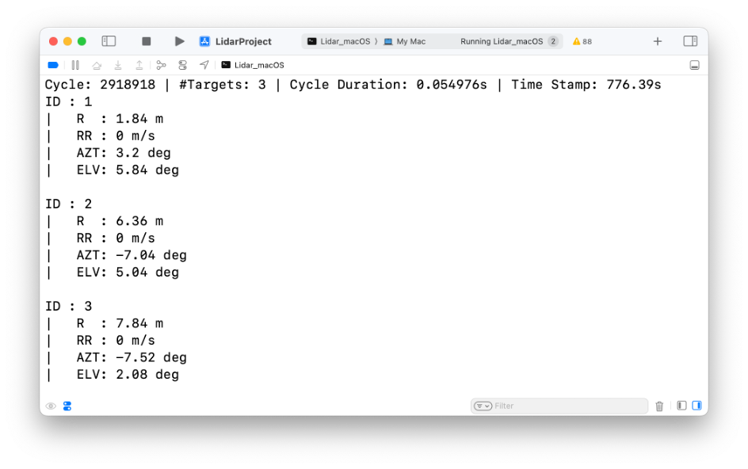
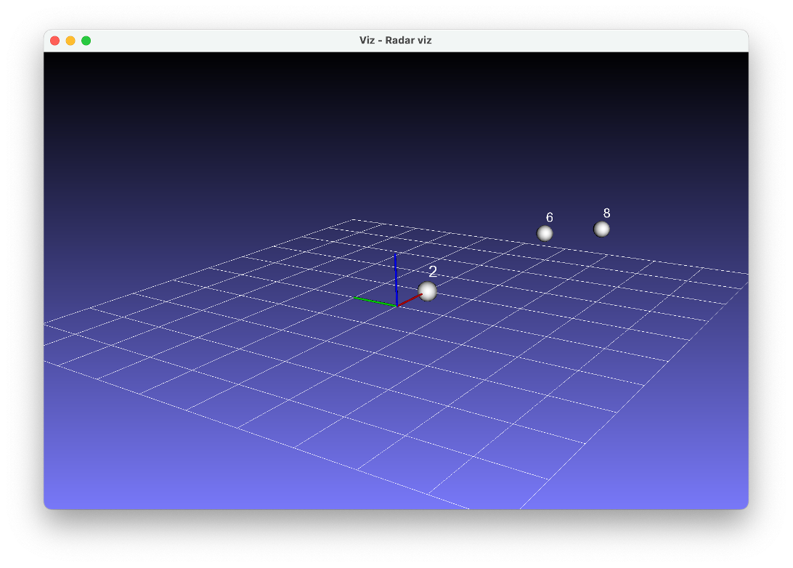

# UMR11 Type 132 Radar CAN driver for MacOS 
## Dependancies:
- [KvaserCAN-Library](https://github.com/mac-can/KvaserCAN-Library.git)
- [OpenCV](https://github.com/opencv/opencv.git)

## Build Instructions:
1. Clone the repository
2. make sure opencv is installed on your system
3. Run `make` in the root directory
4. Run `./umr11` to start the program with the provided sample CSV data.

## Usage:
- The Sensor::Offline_UMR11 reads the CSV file and displays the radar data in a window.
  - data is ID,Byte0,Byte1,Byte2,Byte3,Byte4,Byte5,Byte6,Byte7 in the CSV file.
  
- The Sensor::Online_UMR11 reads the radar data from the CAN bus and displays the radar data in a window.
  - The CAN bus is read using the KvaserCAN-Library on macOS.
  - the methods do exactly as the names suggest.
  - The radar data is displayed in a window using OpenCV. 

## Data Format:

## Example when running:

